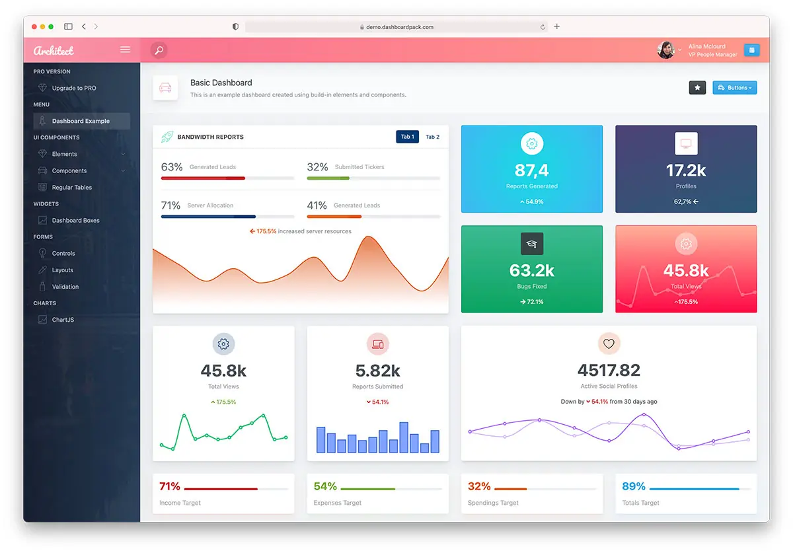

# ArchitectUI React Bootstrap Admin Dashboard Template (FREE)

**React 19 Compatible** - A modern, responsive admin dashboard template built with React 19, Bootstrap 5, and comprehensive component library.

[](https://demo.dashboardpack.com/architectui-react-free/)

[**View Live Demo**](https://demo.dashboardpack.com/architectui-react-free/)

## Overview

ArchitectUI React is a feature-rich, free admin dashboard template designed for modern web applications. Built with the latest React 19 and Bootstrap 5, it provides a solid foundation for creating professional admin panels, dashboards, and web applications.

This template offers clean, responsive design with a comprehensive set of UI components, charts, forms, and layout options. Perfect for startups, enterprises, and developers looking for a production-ready admin dashboard solution.

## What's New in 4.8.0

A security-refresh release — see [Changelog.md](Changelog.md) for the full detail.

- **5 high-severity `npm audit` vulnerabilities → 0**, including the Dependabot-flagged **PostCSS path traversal** ([GHSA-r28c-9q8g-f849](https://github.com/advisories/GHSA-r28c-9q8g-f849)) — `postcss` is now 8.5.25.
- **`react-router-dom` → `react-router` 8.3.0.** The React Router RSC CSRF advisory affects the entire `7.12.0 – 8.2.0` range, and `react-router-dom` is discontinued at 7.18.2 pinned to a vulnerable 7.x. Since v7's `react-router-dom` was already a re-export shim, this is a pure import swap with no behaviour change.
  - ⚠️ **Update your custom pages**: change `from 'react-router-dom'` to `from 'react-router'`.
- **Major bumps, all verified**: `react-dropzone` 15 → 20, `apexcharts` 5 → 6, `@testing-library/jest-dom` 6 → 7, `jsdom` 29 → 30.
- **React 19.2.8**, Vite 8.2, Vitest 4.1.10, Sass 1.102 and the rest of the stack on latest.
- **Now requires Node.js 22+** (`react-dropzone` 20, `jest-dom` 7).
- **Verified green**: 0 lint errors, 23/23 unit tests, clean production build.
- **ESLint held at 9.x** — its `react` / `jsx-a11y` plugins still don't support ESLint 10.

## Previous Release: 4.7.0

- **6 `npm audit` vulnerabilities → 0**; `react-router` 7.18.0 and `vite` 8.1.0 patched two high-severity advisories.
- **`Rating` component** rewritten to React's adjust-state-during-render pattern.

## Key Features

### Core Technologies

- **React 19.2** - Latest React with improved performance and features
- **Vite 8** - Lightning-fast build tool with instant HMR
- **Vitest 4** - First-party test runner with React Testing Library
- **Bootstrap 5.3.8** - Modern CSS framework with utilities
- **Redux Toolkit** - State management
- **React Router v8** - Navigation and routing
- **Sass/SCSS** - Advanced styling capabilities

### UI Components

- **30+ Ready-to-use Components** - Forms, tables, charts, modals, and more
- **Multiple Dashboard Layouts** - Analytics, CRM, Commerce, Sales, and Minimal
- **Advanced Form Elements** - Date pickers, file uploads, text editors, sliders
- **Data Visualization** - ApexCharts, Chart.js, Recharts integration
- **Interactive Maps** - Leaflet/OpenStreetMap and Vector Maps (no API key required)
- **Responsive Design** - Mobile-first approach with all device compatibility

### Layout Options

- **Flexible Sidebar** - Collapsible with custom themes
- **Header Variations** - Multiple header styles and configurations
- **Footer Components** - Fixed and dynamic footer options
- **Theme Customization** - 9 pre-built color schemes
- **Dark Mode Support** - Professional dark theme option

## Quick Start

### Prerequisites

- **Node.js** (LTS version) - [Download here](https://nodejs.org/en/download/)
- **npm** or **yarn** package manager

### Installation

1. **Clone or Download** the repository

   ```bash
   git clone https://github.com/DashboardPack/architectui-react-theme-free.git
   cd architectui-react-theme-free
   ```

2. **Install Dependencies**

   ```bash
   npm install --legacy-peer-deps
   ```

3. **Start Development Server**

   ```bash
   npm start
   ```

   The application will open in your browser at `http://localhost:3001`

### Build for Production

1. **Create Production Build**

   ```bash
   npm run build
   ```

2. **Preview Production Build**

   ```bash
   npm run preview
   ```

   View the production build at `http://localhost:4173`

## Project Structure

```text
architectui-react-theme-free/
├── .github/workflows/      # GitHub Actions CI workflow
├── public/                 # Static files
├── src/
│   ├── assets/             # SCSS entry, images, themes
│   ├── components/         # Reusable UI components
│   ├── config/             # Redux store configuration
│   ├── DemoPages/          # Demo pages and examples (lazy-loaded)
│   │   ├── Dashboards/     # Dashboard variations
│   │   ├── Components/     # UI component examples
│   │   ├── Forms/          # Form examples
│   │   └── Tables/         # Table examples
│   ├── Layout/             # Layout components
│   │   ├── AppHeader/      # Header components
│   │   ├── AppSidebar/     # Sidebar components
│   │   └── AppFooter/      # Footer components
│   ├── reducers/           # Redux slices (ThemeOptions)
│   └── utils/              # Small shared helpers
├── .env.example            # Documented VITE_* env vars
├── vite.config.js          # Vite configuration (env-driven)
├── vitest.config.js        # Vitest configuration
├── vitest.setup.js         # Shared test setup
├── eslint.config.js        # ESLint flat config
└── package.json            # Dependencies and scripts
```

## Available Scripts

| Command                     | Description                                             |
| --------------------------- | ------------------------------------------------------- |
| `npm start` / `npm run dev` | Start the Vite dev server (default port 3001)           |
| `npm run build`             | Create production build in `build/`                     |
| `npm run build:analyze`     | Build and open the Rollup bundle visualizer             |
| `npm run preview`           | Preview the production build locally (port 4173)        |
| `npm run lint`              | Run ESLint                                              |
| `npm run lint:fix`          | Run ESLint and auto-fix what it can                     |
| `npm run format`            | Run Prettier in write mode                              |
| `npm run format:check`      | Run Prettier in check-only mode                         |
| `npm test`                  | Run Vitest in watch mode                                |
| `npm test -- --run`         | Run the test suite once (same mode CI uses)             |
| `npm run test:ui`           | Open the Vitest UI                                      |
| `npm run test:coverage`     | Run the suite once with v8 coverage reporting           |
| `npm run test:e2e`          | Run the Playwright route smoke test against the preview |
| `npm run test:e2e:install`  | One-off: install the Chromium browser Playwright uses   |

## Environment Variables

Copy [.env.example](.env.example) to `.env.local` and adjust as needed. Only `VITE_`-prefixed keys are exposed to the browser bundle.

| Key         | Default | Effect                                                                                                         |
| ----------- | ------- | -------------------------------------------------------------------------------------------------------------- |
| `VITE_PORT` | `3001`  | Dev server port                                                                                                |
| `VITE_BASE` | `./`    | Public base path used by the production build (set to e.g. `"/architectui/"` when deploying to a subdirectory) |

## Testing

Two layers of tests:

**Unit / component (Vitest + React Testing Library)** — tests live next to the code as `*.test.jsx`:

```bash
npm test              # watch mode
npm test -- --run     # single run
npm run test:coverage # v8 coverage report under coverage/
```

Shared setup (matchers, RTL cleanup, `matchMedia` / `ResizeObserver` / `localStorage` shims) is in [vitest.setup.js](vitest.setup.js); config is in [vitest.config.js](vitest.config.js).

**End-to-end (Playwright)** — [e2e/routes.spec.js](e2e/routes.spec.js) spins up `npm run preview` and walks 24 demo routes, failing on any uncaught page error or "Element type is invalid" / "not a constructor" console error. First run needs the browser installed:

```bash
npm run test:e2e:install    # once
npm run test:e2e            # run the suite
```

Config in [playwright.config.js](playwright.config.js).

## Reliability Features

- **Top-level `<ErrorBoundary>`** ([src/components/ErrorBoundary.jsx](src/components/ErrorBoundary.jsx)) catches any render-time crash in the demo pages and shows a friendly card with the error message, component stack (dev only), and a reload button instead of blanking the screen.
- **Theme preferences persist to `localStorage`** ([src/config/persistThemeOptions.js](src/config/persistThemeOptions.js)). Color scheme, fixed-header / fixed-sidebar / fixed-footer toggles, background image, dark-mode choice, and the page-title options all survive refresh. A whitelist controls what gets written so non-persisted UI state stays in memory.
- **Dark mode** via Bootstrap 5.3's `data-bs-theme`. Auto (follows `prefers-color-scheme`), Light, or Dark — picked from the ThemeOptions side panel and persisted. [`src/hooks/useDarkModeSync.js`](src/hooks/useDarkModeSync.js) keeps `<html>` in sync and re-reacts to OS changes when the user leaves the pref on Auto.
- **Accessibility basics** — skip-to-content link, `<header>` / `<nav>` / `<main>` landmarks, `:focus-visible` rings, `aria-label` / `aria-expanded` / `aria-pressed` on icon-only buttons, keyboard activation on the mobile overlay scrim.

## Starting a new project

See [STARTER.md](STARTER.md) for the full "strip to starter" guide. Short version: `rm -rf src/DemoPages/`, swap three files, and you're left with just the shell + reliability features.

## Continuous Integration

GitHub Actions runs on every push and pull request using the Node version pinned in [.nvmrc](.nvmrc). Pipeline:

1. `npm ci --legacy-peer-deps`
2. `npm run lint`
3. `npx vitest run`
4. `npm run build`
5. `npx playwright install --with-deps chromium`
6. `npx playwright test --project=chromium` (Playwright report uploaded as an artifact if any step fails)

See [.github/workflows/ci.yml](.github/workflows/ci.yml).

## Browser Support

ArchitectUI React supports all modern browsers:

- **Chrome** (latest)
- **Firefox** (latest)
- **Safari** (latest)
- **Edge** (latest)
- **Opera** (latest)

## Customization

### Theme Colors

Customize the color scheme by modifying the Sass variables in:

- `src/assets/themes/[theme-name]/_variables.scss`

### Layout Configuration

Adjust layout settings in:

- `src/reducers/ThemeOptions.jsx`

### Adding New Components

Follow the existing component structure in:

- `src/DemoPages/Components/`

## Available Versions

ArchitectUI is available in multiple frameworks:

| Framework       | Repository                                                                                                                    | Status       |
| --------------- | ----------------------------------------------------------------------------------------------------------------------------- | ------------ |
| **React**       | [Free Version](https://github.com/DashboardPack/architectui-react-theme-free)                                                 | ✅ Active    |
| **Vue.js**      | [Vue Version](https://dashboardpack.com/theme-details/architectui-dashboard-vue-pro/)                                         | ✅ Available |
| **Angular**     | [Angular Version](https://dashboardpack.com/theme-details/architectui-angular-7-bootstrap-material-design-pro?v=7516fd43adaa) | ✅ Available |
| **HTML/jQuery** | [HTML Version](https://dashboardpack.com/theme-details/architectui-dashboard-html-pro)                                        | ✅ Available |

## Professional Version

Upgrade to **[ArchitectUI React PRO](https://dashboardpack.com/theme-details/architectui-dashboard-react-pro)** for additional features:

- **200+ Premium Components** - Extensive widget and component library
- **9+ Dashboard Layouts** - Analytics, CRM, Commerce, Sales, and more
- **300+ Color Combinations** - Unlimited customization options
- **Premium Chart Libraries** - Advanced data visualization
- **Extended Form Elements** - Rich form controls and validation
- **Professional Support** - Priority email support
- **Regular Updates** - Continuous improvements and new features
- **Commercial License** - Use in unlimited projects

**Pricing:** Starting at $69 (Personal), $149 (Developer), or $349 (Lifetime)

[**Get PRO Version**](https://dashboardpack.com/theme-details/architectui-dashboard-react-pro) | [**View PRO Demo**](https://demo.dashboardpack.com/architectui-react-pro/)

## Resources & Templates

### DashboardPack - Premium Admin Templates

[DashboardPack.com](https://dashboardpack.com/) offers professional admin dashboard templates in multiple frameworks:

**ArchitectUI Family:**

- [ArchitectUI React PRO](https://dashboardpack.com/theme-details/architectui-dashboard-react-pro) - React 19 + Bootstrap 5
- [ArchitectUI Vue PRO](https://dashboardpack.com/theme-details/architectui-dashboard-vue-pro/) - Vue.js + Bootstrap 5
- [ArchitectUI Angular PRO](https://dashboardpack.com/theme-details/architectui-angular-7-bootstrap-material-design-pro) - Angular + Bootstrap 5
- [ArchitectUI HTML PRO](https://dashboardpack.com/theme-details/architectui-dashboard-html-pro) - HTML/jQuery + Bootstrap 5

**Other Premium Templates:**

- Finance SaaS Dashboard
- Marketing Dashboard
- Sales Dashboard
- TailPanel (TailwindCSS)

[Browse All Templates](https://dashboardpack.com/)

### Colorlib - Free Templates & Resources

[Colorlib.com](https://colorlib.com/) provides free web templates and helpful articles:

**Recommended Articles:**

- [15 Best React Admin Dashboard Templates](https://colorlib.com/wp/react-dashboard-templates/) - Comprehensive guide to React dashboards
- [42 Free Bootstrap Admin Dashboard Templates](https://colorlib.com/wp/free-bootstrap-admin-dashboard-templates/) - Bootstrap admin template roundup

**Free Template Categories:**

- Admin dashboards
- Landing pages
- Portfolio templates
- Blog themes

[Explore Colorlib](https://colorlib.com/)

## Technical Details

### Dependencies

- **UI Framework**: Bootstrap 5.3.8, Reactstrap 9.2.3
- **Charts**: ApexCharts 5.13, Chart.js 4.5, Recharts 3.8
- **Maps**: Leaflet 1.9, react-simple-maps 3.0
- **Icons**: FontAwesome 7.2, React Icons 5.6
- **Forms**: React Select, React Datepicker, @react-input/mask, rc-input-number
- **Editor**: react-simple-wysiwyg
- **Notifications**: SweetAlert2, React Toastify
- **Animations**: Framer Motion 12.40
- **State Management**: Redux Toolkit 2.12, React Redux 9.3
- **Build Tools**: Vite 8, Sass 1.99
- **Quality**: ESLint 9 (flat config), Prettier 3, Vitest 4 + React Testing Library 16, Playwright 1.59

### Performance Features

- **Lightning-Fast HMR** - Instant hot module replacement with Vite
- **Code Splitting** - Automatic route-based code splitting
- **Tree Shaking** - Eliminate unused code
- **Optimized Builds** - Minified and compressed assets
- **Lazy Loading** - Components load on demand

## Contributing

We welcome contributions. Read [CONTRIBUTING.md](CONTRIBUTING.md) for the full developer workflow (scripts, env vars, testing, commit style, PR checklist). Short version:

1. Fork the repository
2. Create a feature branch (`git checkout -b feature/amazing-feature`)
3. Make sure `npm run lint`, `npm test -- --run`, and `npm run build` all pass locally — same checks CI runs
4. Commit your changes (`git commit -m 'Add amazing feature'`)
5. Push to the branch (`git push origin feature/amazing-feature`) and open a Pull Request

## License

This project is licensed under the **MIT License** - see the [LICENSE](LICENSE) file for details.

```
MIT License

Copyright (c) 2023 DashboardPack

Permission is hereby granted, free of charge, to any person obtaining a copy
of this software and associated documentation files (the "Software"), to deal
in the Software without restriction, including without limitation the rights
to use, copy, modify, merge, publish, distribute, sublicense, and/or sell
copies of the Software...
```

## Support & Community

### Get Help

- **Documentation**: Comprehensive guides and examples included
- **GitHub Issues**: Report bugs and request features
- **Community**: Join our developer community

### Stay Updated

- **GitHub**: Star the repository for updates
- **DashboardPack**: Follow for new template releases
- **Changelog**: Check [CHANGELOG.md](Changelog.md) for version history

## Credits

**Developed by**: [DashboardPack.com](https://dashboardpack.com/)  
**Design**: Professional UI/UX team  
**Maintained by**: Open source community

---

**Made with care for the developer community**

[Website](https://dashboardpack.com/) • [Templates](https://dashboardpack.com/) • [Support](https://dashboardpack.com/contact/) • [Free Resources](https://colorlib.com/)
